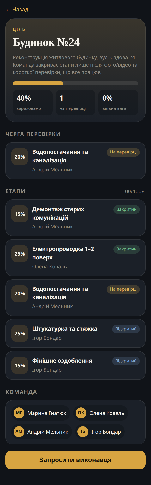
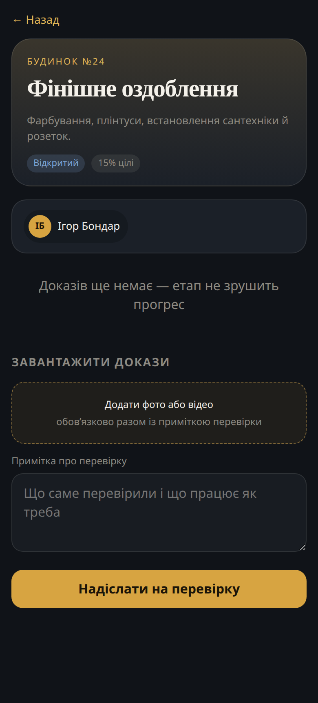

# Цільник

Telegram Mini App для команд, які ведуть **спільну ціль** і приймають роботу лише з доказами.

Підходить для підрядників на будівництві, фриланс-команд і будь-якого проєкту, де етапи мають різну вагу, а «зроблено» без фото/відео і короткої перевірки не рахується.

Прогрес-бар рухається **тільки** коли головний закриває етап після рев’ю. Завантажені, але не затверджені докази відсоток не додають.

## Ролі

**Головний** створює ціль, додає виконавців (Telegram user id або одноразовий код), бачить усю картину: прогрес, етапи, хто на чому, чергу на перевірку. Закриває або відхиляє етап.

**Виконавець** бачить лише свої етапи. Ділить ціль на стадії з вагою % (сума на цілі = 100%). Етап не готовий, доки немає фото і/або відео **і** короткої примітки, що все працює як треба.

## Демо-сид

Після старту API сіє ціль **«Будинок №24»**: 5 етапів, троє виконавців, мікс статусів (закрито / на перевірці / відкрито). У браузері з `DEMO_MODE=true` можна відкрити обидві ролі без Telegram-токена.

## Як запустити

```bash
cp .env.example .env
# BOT_TOKEN можна лишити заглушкою — api, postgres і mini app піднімуться
docker compose up --build
```

Сервіси:

| Сервіс   | Адреса                |
|----------|------------------------|
| Mini App | http://localhost:8080  |
| API      | http://localhost:8000  |
| Postgres | localhost:5432         |
| Бот      | polling, без порту     |

Якщо `BOT_TOKEN` — заглушка (`000000:changeme`), бот не падає: пише в лог і чекає справжній токен. Mini App усе одно працює.

Тести:

```bash
docker compose exec api pytest -q
```

## Як відкрити в Telegram

1. Створіть бота в [@BotFather](https://t.me/BotFather), вставте токен у `.env` як `BOT_TOKEN`.
2. Mini App у проді має бути на **HTTPS**. Локально — тунель (`cloudflared`, `ngrok`) на порт `8080`, і цей URL у `WEBAPP_URL`.
3. Перезапустіть `docker compose up`. У чаті з ботом — `/start` і кнопка **Відкрити цілі** (WebApp).
4. Telegram шле `initData`. Бекенд перевіряє HMAC (`WebAppData` + токен бота), клієнту не довіряє, видає JWT.
5. `OWNER_TELEGRAM_ID` — Telegram id головного. Цей акаунт отримує роль owner під час першого входу.

## Змінні (.env.example)

- `BOT_TOKEN` — токен бота
- `WEBAPP_URL` — URL Mini App для кнопки WebApp
- `DATABASE_URL` — PostgreSQL
- `JWT_SECRET` — секрет JWT
- `OWNER_TELEGRAM_ID` — bootstrap головного
- `DEMO_MODE` — вхід у браузері без Telegram (локальні скріншоти)
- `UPLOAD_DIR` — локальний том для фото/відео (не S3)

## Скріншоти





## Стек

- Python 3.12, FastAPI, SQLAlchemy 2, Alembic, PostgreSQL
- aiogram 3
- Vite + TypeScript Mini App, тема Telegram (`bg_color`, `text_color`, `button_color`, …)
- Докази — файли на томі Docker
